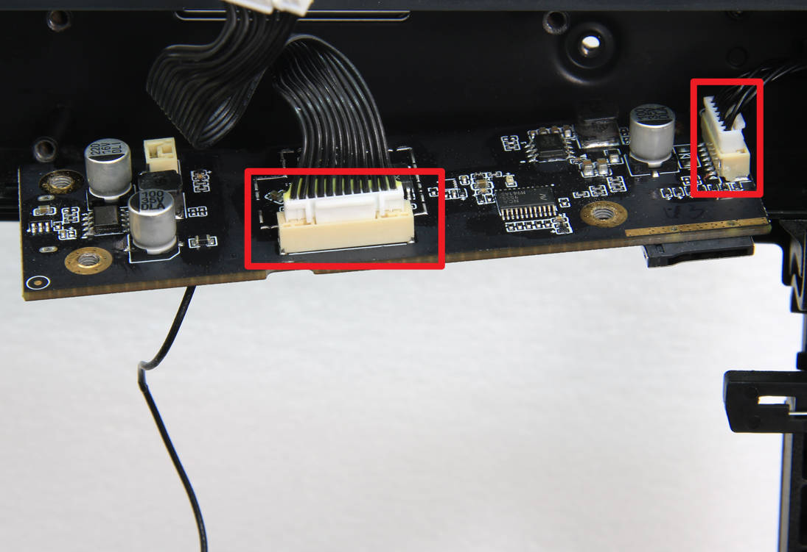

# OpenBL
##Exploration of Bambu Lab Printer Hardware and Firmware

This repository is for information related to the hardware used in Bambu Lab printers. Bambu Lab printers are closed source and any information shared here is derrived by observation and reading publicly available documentation. If you notice any mistakes or would like to add something, please submit an issue on the Github repo or submit a pull request.

The name OpenBL is inspired by another project called OpenFL. OpenFL is Open Form Labs, so it made sense to call this Open Bambu Lab.

## Motion Control

The motion control system of Bambu Lab's X1 and P1 series of printers consists of an Application Processor, Machine Controller board and a Toolhead board.

## P1 Series
*Note: The P1 and X1 Series printers are similar, but do have different control boards*

### Machine Controller

The Machine Controller (MC) is the main microcontroller in the P1. It has a Spintrol [SPC2168APE80](docs/Spintrol_SPC2168_Datasheet_Rev11.pdf) MCU and [AT8236](docs/AT8236_Datasheet.pdf) motor drivers to control the A, B (Bambu calls these "Left and Right motors") and Z axis steppers. It is located on the back of the printer, behind the metal rear panel adjacent to the so called poop chute (Bambu is more polite and named this the ["excess chute"](https://wiki.bambulab.com/en/p1/maintenance/excess-chute)).

|No.| Connector                       | No.| Connector                          | No.| Connector                               |
|---| ------------------------------------ |--- | --------------------------------------- |--- | -------------------------------------------- |
| 1 | Z Motor                              | 5  | Auxiliary part cooling fan              | 9  | AP main board(power and communication cable) |
| 2 | Right motor (view from the rear)     | 6  | MC board fan                            | 10 | TH board(power and communication cable)      |
| 3 | Left motor (view from the rear)      | 7  | MC board to AC board connecting cable   | 11 |                                              |
| 4 | Chamber temperature regulator fan    | 8  | AMS interface board 	                  |    |                                              |

*(this table is from the Bambu Lab Wiki and is presumed to be correct)*

### Toolhead Controller

The Toolhead (TH) controller is, unsurprisingly, located on the toolhead of the printer. It is connected to the MC board via a 6-pin JST style connector. It contains a Spintrol [SPC1168APE48](docs/Spintrol_SPC1168_Datasheet_Rev13.pdf) MCU and an [AT8236](docs/AT8236_Datasheet.pdf) motor controller for the extruder. The toolhead connects to an interface board for the hotend heater, thermistor, hotend fan and part cooling via a flexible printed circuit (FPC) cable.

*Front side of TH board. 
- FPC connector for TH interface board is top left. 
- Motor connector is the larger white connector. 
- Smaller connector is not connected to anything - perhaps it is a programming interface?*

*Back side of TH board. TH board to MC board connector highlighted in red*

*Toolhead Cable - 6 conductor (two red, two black, one green and one white). 
Speculation: red and black wires could be 24V, green and white could be CAN high and CAN low (someone needs to test)*

### Application Processor

The Application Processor (AP) board is located behind the user interface on the front of the printer. The AP board connects to the MC board via a 12 conductor cable.

*Back side of AP Board. Left is the MC to AP connector, Right is the screen/user interface cable*

*Front side of the AP Board*
|No.| Connector     | No.| Connector                 |
|---| --------------|--- | ------------------------- |
| 1 | USB           | 5  | Camera FPC (probably CSI) |
| 2 | Not Connected | 6  | LED                       |
| 3 | Antenna       | 7  | SD Card                   |
| 4 | Not Connected |    |                           | 

### Notes:
You may have noticed that the X1 and A1 series of printers are missing. These will be added eventually. The information above is also likely to grow with time as we learn more about these printers. This is just the beginning. Much work remains to be done!

### Datasheets:
- [AT8236 (Chinese)](docs/AT8236_Datasheet.pdf) - *if anyone has an English version, please share it*
- [SPC1168 (English)](docs/Spintrol_SPC1168_Datasheet_Rev13.pdf)
- [SPC2168 (English)](docs/Spintrol_SPC2168_Datasheet_Rev11.pdf)

### Sources:
- [Bambu Lab Wiki](https://wiki.bambulab.com/)
-[Dr Terrible's House of Bloggable: X1 Carbon Notes](https://charliex2.wordpress.com/2023/01/07/bambu-x1-carbon-notes/)
